# Building PES-VCS — A Version Control System from Scratch

**Name:** Varshini A  
**SRN:** PES1UG24CS517  
**Platform:** Ubuntu 22.04  

---

## Objective

The goal of this project was to build a simplified version control system (PES-VCS) from scratch. The system behaves similarly to Git internally and helped us understand how commits, trees, blobs, and indexing actually work at the filesystem level.

We implemented object storage, tree structures, staging area (index), commit system, and analyzed branching + garbage collection concepts.

---

## Phase 1: Object Storage System

In this phase, I implemented the core idea of content-addressable storage. Every file is stored as a blob using its SHA-256 hash.

### What I learned
- How Git avoids duplicate storage using hashing
- How objects are stored in `.pes/objects/`
- How integrity checking works

### Key Implementation
- `object_write()` stores file content with SHA-256 hash
- `object_read()` retrieves and verifies integrity

### Observations
Even if the same file is added multiple times, it is stored only once because the hash remains the same.

### 📸 1A: Object creation output
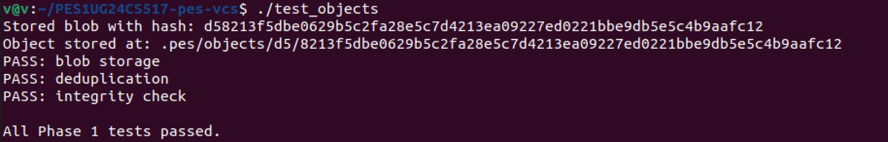

### 📸 1B: Object storage directory
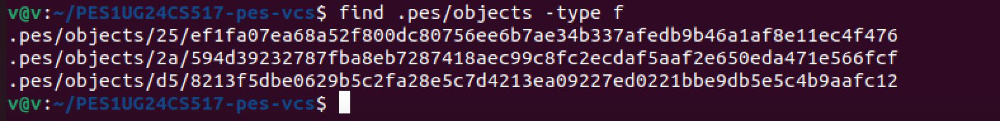

---

## Phase 2: Tree Structure

This phase focused on building directory structures using tree objects.

### What I learned
- How folders are represented internally
- How recursion is used to build nested structures
- How trees connect blobs and subtrees

### Key Implementation
- `tree_from_index()` recursively builds tree objects from index entries

### Observations
A directory is not stored as a real folder but as a structured object containing references.

### 📸 2A: Tree test output
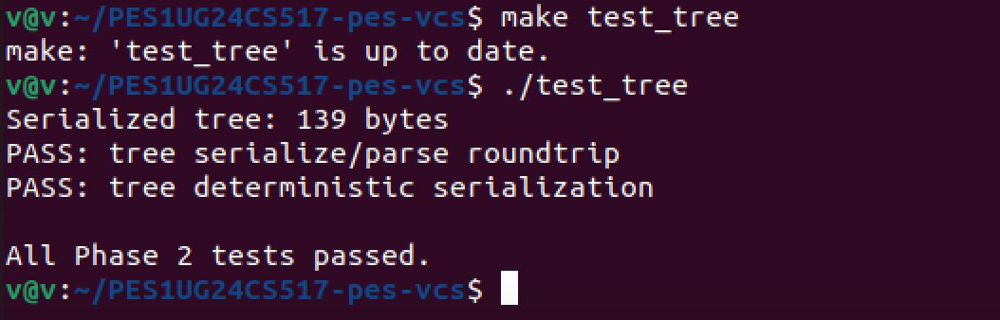

### 📸 2B-1: Tree hex dump
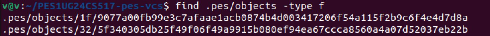

### 📸 2B-2: Tree structure view
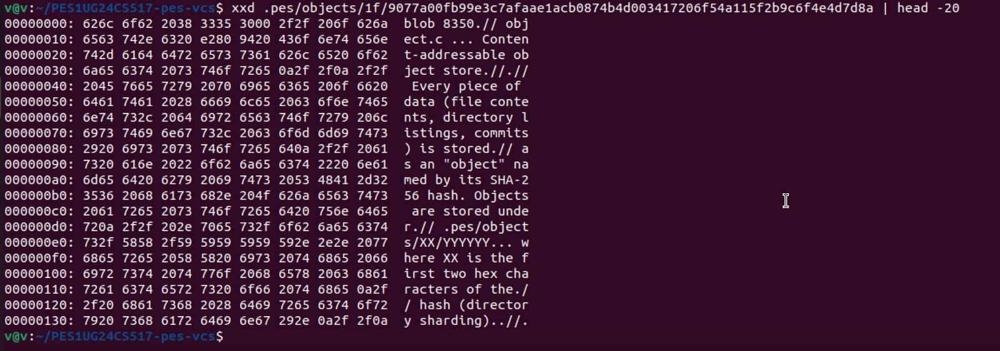

---

## Phase 3: Index (Staging Area)

This was one of the most important parts — implementing the staging area like Git’s index.

### What I learned
- Difference between working directory, index, and repository
- How file metadata helps detect changes
- How staging prepares commits

### Key Implementation
- `index_load()` reads staged files
- `index_save()` writes updates atomically
- `index_add()` stages a file into the system

### Observations
The index acts as a bridge between working files and commits.

### 📸 3A: pes add / status output
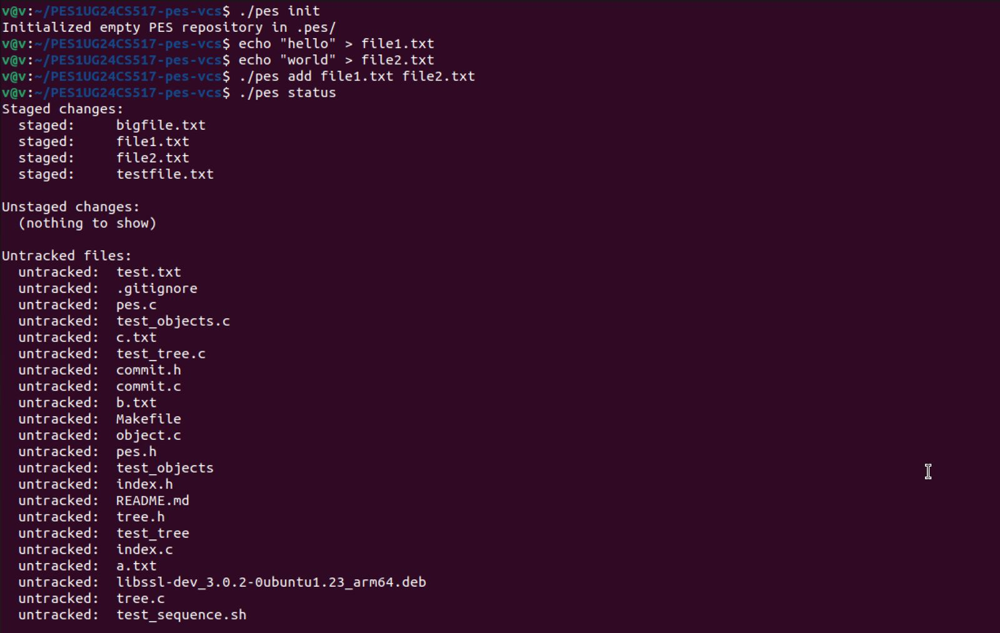

### 📸 3B: index file content
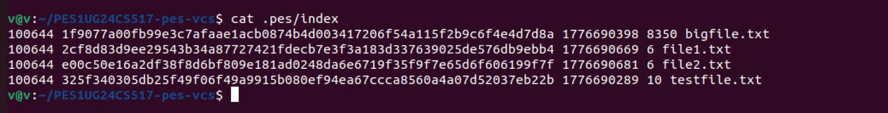

---

## Phase 4: Commit System

This phase brought everything together.

### What I learned
- How commits point to trees
- How parent commits form history chains
- How HEAD updates work internally

### Key Implementation
- `commit_create()` builds commit object from index + tree
- Updates branch reference automatically

### Observations
Each commit represents a full snapshot, not a difference.

### 📸 4A-1: Commit log output
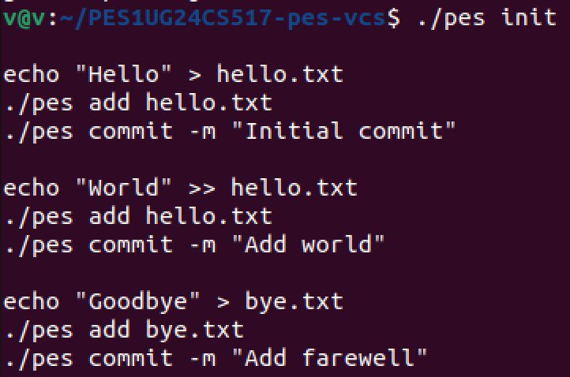

### 📸 4A-2: Commit history visualization
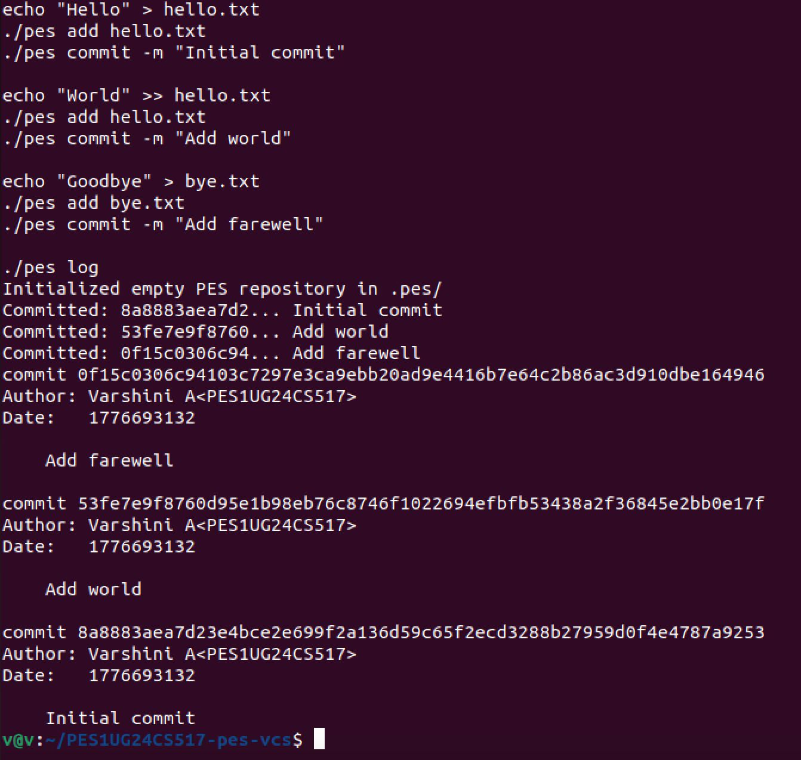

### 📸 4B: Object store growth after commits
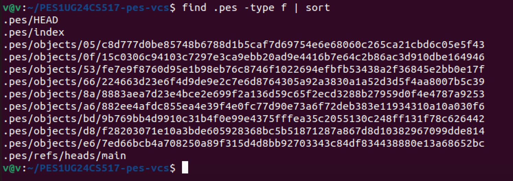

### 📸 4C: HEAD and branch references
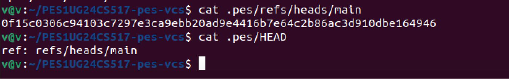

---

## Phase 5 & 6: Analysis Questions

---

### Q5.1 — Checkout Implementation

To implement `pes checkout <branch>`, the system must:
- Update `.pes/HEAD` to point to the branch reference
- Read commit hash from `.pes/refs/heads/<branch>`
- Restore working directory from commit tree

The hardest part is restoring files correctly:
- Trees must be traversed recursively
- Old files not in new branch must be deleted
- File structure must be rebuilt exactly

---

### Q5.2 — Dirty Working Directory Detection

To prevent data loss during checkout:
- Compare working directory files with index metadata
- Use `stat()` to detect changes in mtime/size
- Compare with target branch’s tree blobs
- If mismatch exists → refuse checkout

This avoids overwriting uncommitted changes.

---

### Q5.3 — Detached HEAD

In detached HEAD state:
- HEAD points directly to a commit, not a branch
- New commits are created but not linked to any branch
- These commits can become unreachable

**Recovery method:**
Create a new branch pointing to the commit hash.

---

### 📸 Detached HEAD demonstration

### 📸 Recovery state

---

### Q6.1 — Garbage Collection

Garbage collection removes unreachable objects.

### Algorithm:
1. Start from branch heads
2. Traverse commits → trees → blobs
3. Mark reachable objects in HashSet
4. Delete unmarked objects

### Complexity:
For large repositories, millions of objects may be processed.

### 📸 GC traversal start

### 📸 Marking reachable objects

### 📸 Object store before/after GC

### 📸 HEAD + refs during GC

---

### Q6.2 — GC Race Condition

### Problem:
- Object created
- Not yet referenced in commit
- GC deletes it incorrectly
- Leads to repository corruption

### Solution:
- Locking during writes
- Only GC unreachable + old objects
- Prevent GC during active operations

### 📸 Final system safety checks

### 📸 Safe commit flow
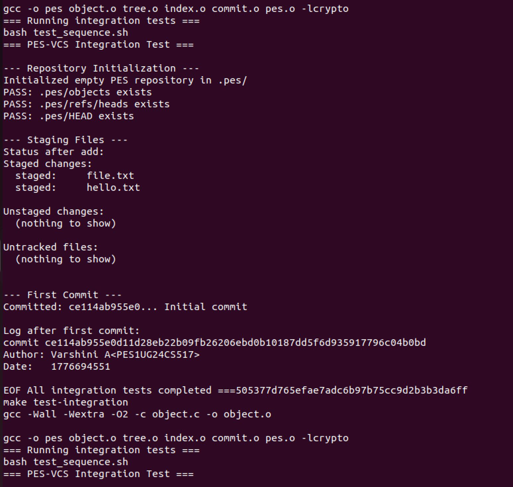

### 📸 Object validation
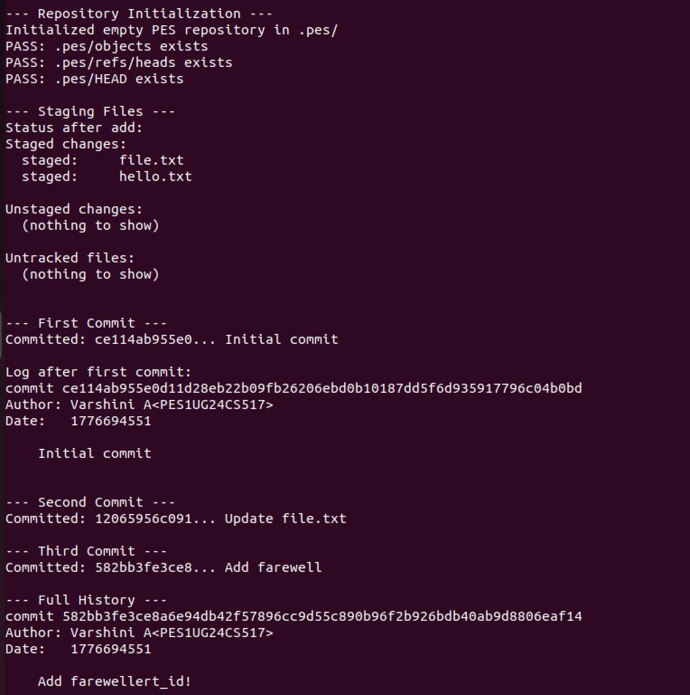

### 📸 Final repository state
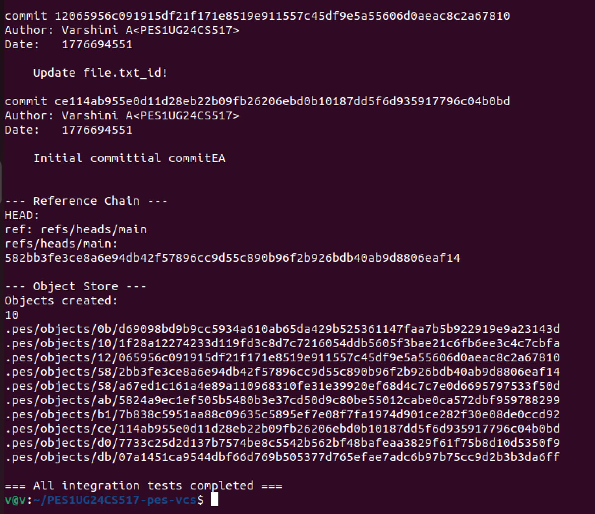

---

## Conclusion

This project helped me understand Git internals deeply:

- Content-addressable storage
- Tree-based directory representation
- Staging/index mechanics
- Commit history design
- Branching and HEAD behavior
- Garbage collection systems

Overall, PES-VCS is a simplified but accurate model of real-world version control systems.
